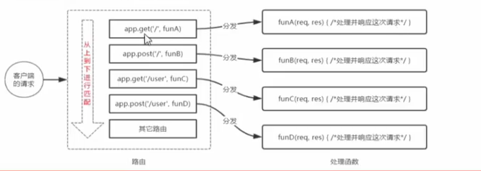

### 项目
[地址](https://gitee.com/tomoto_t/dm/tree/master/node/node-study)
## 基础
### cmd 命令

```js
D: 直接切换到硬盘D
git 命令行用 cd /d切到D盘
ls 显示当前文件夹得所有的文件目录  lunix下的
dir查看文件目录  dos下的
tab  自动补全
cd    切换到对应的文件目录
cd .. 切换到上一级文件
touch  创建文件
del 删除文件
mkdir  创建文件夹
md 创建文件夹
rd 删除文件夹，文件夹必须为空
pwd  显示文件目录路径
rm -rf   不询问强制删除文件或文件夹
ctrl + c 强制退出 当前命令
cat fileName 查看某个文件内容
```
> 注：直接输入文件名或调用程序，可以直接打开文件，如果不是在当前目录下打开，会在环境变量path中依次查找，直到找到为止，找不到，会报，不是内部或外部命令

### 进程和线程
进程
    - 进程负责为程序的运行提供必备的环境
    - 进程相当于工厂中的车间
线程
    - 线程计算机中的最小的计算单位，线程负责执行进程中的程序
    - 线程相当于工厂中的工人
node服务器是单线程的
    - node处理请求时是单线程，但是在后台拥有一个I/O线程池

### 模块化
- 在node中，一个js文件就是一个模块
- 在node中，每个js文件中的js代码都是独立运行在一个函数中而不是全局作用域，所以一个模块中的变量和函数在其他模块中无法访问

[require 实现参考链接](https://mp.weixin.qq.com/s?__biz=MzA4MjA1MDM3Ng==&mid=2450827055&idx=1&sn=18606f354f031eea24544929132f53d8&chksm=886bab08bf1c221e28aadfed3d7983ea98e368e390219facca608c8bdf93ec3b71aee8db39cc#rd) 
这里也体现了exports与module.exports的区别

[exports与module.exports的区别](https://blog.csdn.net/shaleilei/article/details/78297029)

- 在node中有一个全局对象global,他的作用和网页中window类似，在全局中创建的变量都会作为global的属性保存，在全局中创建的函数都会作为global的方法保存
- 当node在执行模块中的代码时，他会首先用一个函数将js文件代码包起来
```js
function (exports, require, module, __filename, __dirname) {
const md = require('./index1.js')
console.log('md', md)
console.log(arguments.callee + "")
}
```
exports 是module.exports的属性

<!-- node 13 开始支持 es module, package.json 中配置 type = module ，表示使用esm规范，同时支持cjs和esm ,以.cjs和. -->

### npm包
- 包实际上就是一个压缩文件，解压后还原为目录，符合规范的目录，应该包含如以下文件
    - package.json 描述文件 必须
    - bin 可执行二进制文件 非必须
    - lib js代码 非必须
    - doc 文档 非必须
    - test 单元测试 非必须

### Buffer
- Buffer 的作用用来存储二进制数据，node作为服务端，接收和发送请求都是以二进制进行传输
- Buffer的结构和数组很像，操作的方法和数组类似
- 数组中不能存储二进制文件，二Buffer就是专门用来存储二进制数据
- 在Buffer中存储的是二进制数据，但是在显示时都是以16进制显示的
- Buffer中每一个元素范围是00 - ff   ff对应二进制是11111111
    - 一个0 或一个1就是1位(bit)
    - 8bit = 1byte(字节) (最小单位字节)
    - 1024byte = 1kb
    - 1024kb = 1mb
    - 1024mb = 1gb
    - 1024gb = 1tb
- Buffer 中的一个元素占用内存中的一个字节 
- Buffer 大小一旦确定，则不能修改，Buffer实际上是对底层内存的直接操作
```js
    Buffer.from(str) // 将一个字符串转换成buffer
    Buffer.alloc(size) // 创建一个指定大小的Buffer
    Buffer.alloUnsafe(size) // 创建一个指定大小的Buffer，但是可能包含敏感数据
    buf.toString() // 将缓冲区的数据转换成字符串
```

## express 

### 托管静态资源

1、express.static()

```js
app.use(express.static(public))
```
现在就可以访问public目录中的所有文件了
```js
localhost:3000/images/bg.jpg
localhost:3000/css/style.css
localhost:3000/js/index.js
```
> 注意 Express 在指定的静态目录中查找文件，并对外提供资源访问路径，因此，存放静态文件的目录名不会出现在URL中

2、托管多个静态资源目录,连续多次调用,从上到下依次查找
```js
app.use(express.static(public))
app.use(express.static(files))
```
3、挂载前缀路径

```js
app.use('/public',express.static('public'))

localhost:3000/public/images/bg.jpg
```

### nodemon 
在编写node.js项目时，如果修改了项目代码，则需要频繁的手动close 然后再重新启动，非常繁琐，可以使用 nodemon这个工具，他能监听项目文件的变动，当修改代码后，nodemon 会自动帮我们重启项目

- 安装
```js
npm install -g nodemon
```
- 使用
```js
nodemon index.js
```

### 路由
express中的路由分3部分组成，分别是请求的类型，请求的URL地址，处理函数
```js
app.METHOD(PATH,HANDLER)
```


挂载路由
```js
app.get('/',(req,res)=>{res.send('hollo')})
app.post('/',(req,res)=>{res.send('hollo')})
```

路由模块化
- 创建路由模块对应的.js
- 调用express.Router()函数创建路由对象
- 向路由对象上挂载具体路由
- 使用module.exports向外共享路由对象
- 使用app.use()注册路由模块

```js
// router/user.js
const express = require('express')
const router = express.Router()
const app = express()

router.get('/user/list', function (req, res) {
    res.send('get user')
})
router.post('/user/add', function (req, res) {
    res.send('add user')
})
module.exports = router


// index.js
const userRouter = require('./router/user')
app.use(userRouter)
```

路由添加模块前缀
```js
// 1导入路由模块
const userRouter = require('./router/user')
app.use('/api',userRouter)
```

### 中间件
中间件，业务流程中的中间处理环节


express 中间件的调用流程
当一个请求到达Express 的服务器之后，可以连续调用多个中间件，从而对这次请求进行预处理

> 注意：中间件函数的形参列表中，必须包含next参数，而路由处理函数中只包含req和res

next 函数的作用
next函数是实现多个中间件连续 调用的关键，它表示把流转关系交给下一个中间件或路由

#### 全局生效的中间件

```js
// 定义中间件函数
const mw = function(req,res,next){
    console.log('这是一个自定义的中间件')
    next()
}
// 注册为全局生效的中间件
app.use(mw)

// 简写
app.use((req,res,next)=>{
    console.log('简写')
    next()
})
```
多个中间件间共享同一个req,res,基于这样的特性，我们可以在上游的中间件中，统一为req或res对象添加自定义属性或方法，共下游中间件或路由使用

定义多个中间件

```js
app.use((req,res,next)=>{
    console.log('1')
    next()
})
app.use((req,res,next)=>{
    console.log('2')
    next()
})
```

#### 局部生效的中间件
不使用app.use()定义的中间件，叫做局部中间件

```js
const mw = function(req,res,next){next()}
app.get('/',mw,function(req,res){
    res.send('hello')
})
```

定义多个中间件
```js
app.get('/',mw1,mw2,function(req,res){
    res.send('hello')
})
app.get('/',[mw1,mw2],function(req,res){
    res.send('hello')
})
```

注册中间件的注意事项
- 一定要在路由前注册中间件
- 客户端发过来的请求可以连续调用多个中间件进行处理
- 执行完中间件的业务代码之后，不要忘记调用next()函数
- 为了防止代码逻辑混乱，调用next()函数后不要再写额外的代码
- 连续调用多个中间件时，多个中间件共享req,res

Express常见5中中间件
- 应用级别
```js
app.use(),app.get(),app.post()
```
- 路由级别
```js
const router = express.Router()
router.use((req,res,next)=>{
    next()
})
```
- 错误级别
```js
app.get('/',(req,res)=>{
    throw new Error('未知错误')
    res.send('hello')
})
app.use((err,req,res,next)=>{
    console.log('发生错误',err.message)
    res.send(err.message)
})
```
> 注意错误级别中间件注册在所有路由之后

- Express 内置  
```js
express.static()
// 配置解析application/json 格式数据的内置中间件 raw json
app.use(express.json())
// 配置解析application/x-www-form-urlencoded 格式数据
app.use(express.urlencoded({extend:false}))
```
- 第三方中间件
body-parser express@4.16.0之前使用
```js
npm i body-parser

const parser = require('body-parser')
app.use(parser.urlencoded({extend:false}))
```

express.urlencoded 就是基于body-parser 封装出来的


### 获取请求参数
- get  
    - req.params 获取动态参数
    - req.query 获取问号拼接参数
- post 
    - req.body 获取参数

### 解析参数
```js
const qs = require('queryString')
qs.parser(url)
```

### Cors 跨域资源共享
cors是Express的一个第三方中间件，通过安装和配置cors中间件解决跨域问题
- 运行 `npm install cors` 安装中间件
- 使用 `const cors = require('cors')` 引入中间价
- 在路由之前配置 `app.use(cors())`

CORS (Cross-Origin Resource Sharing,跨域资源共享) 由一系列HTTP响应头组成，这些HTTP 响应头决定浏览器是否阻止前端js代码跨域获取资源
浏览器的同源安全策略默认会阻止网页"跨域"获取资源，但如果接口配置了CORS相关的HTTP响应头，就可以解决浏览器端的跨域访问限制 ,响应头会新增Access-Control-Allow-Origin 字段

cors 相应头
- Access-Control-Allow-Origin
```js
Access-Control-Allow-Origin:<origin> | *

origin指定允许跨域的域名
* 所有域名都可以跨域
```
- Access-Control-Allow-Headers
默认情况下,CORS仅支持客户端向服务器发送如下9个请求头：
    Accept 、Accept-Language、Content-Language、DPR、Downlink、Save-Data、Viewport-Width、Width、Content-Type(值仅限于text/plain、multipart/form-data、application/x-www-form-urlencoded三者之一)
如果客户端向服务端发送了额外的请求头信息，则需要在服务端，通过Access-Control-Allow-Headers 对额外请求头进行申明，否则这次请求会失败！
```js
res.setHeader('Access-Control-Allow-Headers','Content-Type,X-Custom-Header')
```

- Access-Control-Allow-Methods
默认情况下Cors 仅支持客户端发起Get、Post、Head请求
如果客户端发起Delete、Put等方式请求服务器资源，则需要在服务器端，通过Access-Control-Allow-Methods来指明实际请求所允许使用的HTTP方法
```js
res.setHeader('Access-Control-Allow-Methods','POST,GET,DELETE,HEAD')
res.setHeader('Access-Control-Allow-Methods','*') // 允许所有
```

### 简单请求
同时满足以下两大条件就属于简单请求
- **请求方式**：GET,POST,HEAD三者之一
- **http头部信息** 不超过以下几种字段：无自定义头部字段、Accept 、Accept-Language、Content-Language、DPR、Downlink、Save-Data、Viewport-Width、Width、Content-Type(值仅限于text/plain、multipart/form-data、application/x-www-form-urlencoded三者之一)

### 预检请求
只要符合下列之一就是预检请求
- **请求方式**：GET,POST,HEAD之外的其他method
- 请求头中包含自定义字段
- 向服务器发送了application/json格式数据

在浏览器与服务器正式通讯之前，浏览器会先发送OPTION请求进行预检，已获知服务器是否允许该实际请求所以这一次的请求称为预检请求。服务器成功响应预检请求后，才会发送真正的请求，并携带真实数据

## 数据库

常见的数据库
- mysql(免费)
- oracle(收费)
- sql server(收费)
- mongodb (免费)
其中 mysql、oracle、sql server属于传统型数据库(又叫做关系型数据库或sql数据库)
而mongodb属于新型数据库(又叫做非关系型数据库或nosql数据库) 一定程度上弥补了传统型数据库的缺陷

安装
mysql server

[链接](https://dev.mysql.com/downloads/windows/installer/)

[安装教程](https://www.runoob.com/w3cnote/windows10-mysql-installer.html)

DataType数据类型
init 整数，varchar(len)字符串 ，tinyint(1)布尔值
字段的特殊标识
PK主键唯一标识，NN值不允许为空，UQ 值唯一，AI 值自动增长

使用数据库时打开 mysql workbench  新增表，字段，手动新增待研究
### sql语句
- select
-- 是注释
SELECT * FROM 表名称
SELECT 列名称 FROM 表名称

sql语句中的关键字对大小写不敏感
例：
```sh
select username,password from users
```

-  INSERT INTO 
-- 注意列和值要一一对应，多个列和多个值之间使用英文逗号隔开
INSERT INTO table_name (列1,列2,...) VALUES(值1,值2,...)

```sh
insert into users (username,password) values ('tt',888)
```

- UPDATE
UPDATE 表名称 SET 列名称=新值 WHERE 列名称=某值

```sh
update users set username='yy' where id=1
update users set username='ttt',password=777 where id=2
```

- DELETE
DELETE FROM 表名称 WHERE 列名称=值

```sh
delete from users where id=3
```

- WHERE子句
where子句用于限定选择的标准在select,update,delete语句中皆可用where来限定选择标准
-- 查询语句中的where条件
select 列名称 from 表名称 where 列 运算符 值
-- 更新语句中的where 条件
update 表名称 set 列=新值 where 列 运算符 值
-- 删除语句中的where 条件
delete from 表名称 where 列 运算符 值

运算符
| 操作符 | 描述|
|:-------|:-----:|
|  =    | 等于  |
|  <>    | 不等于  |
|  >    | 大于  |
|  <    | 小于  |
|  >=    | 大于等于  |
|  <=    | 小于等于  |
|  BETWEEN    | 在某个范围内  |
|  LIKE    | 搜索某种模式  |

> 注意在某些版本中<>可以写成!=

```sh
select * from users where status=1
select * from users where id>2
select * from users where username<>'tt'
select * from users where username!='tt'
```

- AND和OR
and 和or 可以在where子语句中把两个或多个条件结合起来
```sh
select * from users where status=1 and id<3
select * from users where status=1 or username='ttt'
```
- ORDER BY 子句
order by 语句默认安照升序(ASC)对记录进行排序，如果按照降序排序可以使用DESC关键字
```sh
select * from users order by status 
select * from users order by status desc
```

多重排序
```sh
select * from users order by id desc, username asc
```

- COUNT(*)函数
COUNT(*)函数用于返回查询结果总条数
```sh
select count(*) from users
select count(*) from users where status=0
```

- AS 为列设置别名
```sh
select count(*) as total from users
select username as uname,password as ps from users
```

### 项目中安装操作mysql
- 安装操作mysql数据库的第三方模块
- 通过mysql模块连接到mysql数据库
- 通过mysql执行sql语句
```js
// npm i mysql
const mysql = require('mysql')
const db = mysql.createPool({
    host:'127.0.0.1', // 数据库的ip地址
    user:'root', // 数据库登录账号
    password:'tjw@123456',// 数据库登录密码
    database:'my_db_01'// 操作哪个数据库
})
// 查询
db.query('SELECT * FROM users', (err, result) => {
    if (err) return console.log(err.message);
    console.log(result)
})

// 新增
const user = {
    username: 'ull',
    password: 234
};
// ? 占位符
const sqlStr = 'INSERT INTO users (username,password) VALUES(?,?)'
db.query(sqlStr, [user.username, user.password], (err, result) => {
    if (err) return console.log(err.message);
    if (result.affectedRows === 1) console.log('数据插入成功')
})
```

插入数据的便捷方式
```js
const user = {username:'rr',password:7878}
const sqlStr = 'INSERT INTO users SET ?'
db.query(sqlStr,user ,(err,result)=>{
    if (err) return console.log(err.message);
    if (result.affectedRows === 1) console.log('数据插入成功')
})
```

更新数据
```js
const user = {id:1,username:'rr',password:7878}
const sqlStr = 'UPDATE users SET username=?,password=? WHERE id=?'
db.query(sqlStr,[user.username,user.password,user.id] ,(err,result)=>{
    if (err) return console.log(err.message);
    if (result.affectedRows === 1) console.log('数据更新成功')
})
```

更新数据便捷方式
```js
const user = {id:1,username:'rr',password:7878}
const sqlStr = 'UPDATE users SET ? WHERE id=?'
db.query(sqlStr,[user,user.id] ,(err,result)=>{
    if (err) return console.log(err.message);
    if (result.affectedRows === 1) console.log('数据更新成功')
})
```

删除数据
```js
const sqlStr = 'DELETE FROM users WHERE id=?'
db.query(sqlStr,4 ,(err,result)=>{
    if (err) return console.log(err.message);
    if (result.affectedRows === 1) console.log('数据删除成功')
})
```

标记删除
执行update语句更行字段状态
```js
// 更新
const sqlStr = 'update users set status=? where id=?'
db.query(sqlStr,[1,1] ,(err,result)=>{
    if (err) return console.log(err.message);
    if (result.affectedRows === 1) console.log('数据删除成功')
})
// 查询
db.query('SELECT * FROM users WHERE status=0', (err, result) => {
    if (err) return console.log(err.message);
    console.log(result)
})
```

### 前后端身份认证
- 服务端渲染推荐使用session认证机制
- 前后端分离推荐使用JWT认证机制

在Express中使用session认证
- 安装express-session中间件
- 配置express-session中间件

```js
const session = require('express-session')
app.use(session({
    secret:'keyboard cat',// secret可以为任意字符串,对session进行加密
    resave:false,// 固定写法
    saveUnintialized:true // 固定写法
}))
```
当express-session中间件配置成功后，即可通过req.session来访问和使用session对象，从而存储用户信息

```js
app.post('/api/login',(req,res)=>{
    if(req.body.username !=='admin'|| req.body.password !=='000000'){
        return res.send({status:1,msg:'登录失败'})
    }
    req.session.user = req.body // 将用户信息存储到session中
    req.session.isLogin = true // 将用户的状态存储到session中
    res.send({status:0,msg:'登录成功'})
})
```

JWT认证机制
session认证机制的局限性，session需配合cookie才能实现，由于cookie默认不支持跨域访问，所以当涉及前端跨域请求后端接口的时候，需要做很多额外的配置才能实现跨域session认证
前后端接口不需要跨域推荐session，需要跨域推荐使用jwt

JWT(json web token) 是目前最流行的跨域认证解决方案

JWT工作原理：

总结：用户的信息通过Token字符串的形式，保存在客户端的浏览器中，服务器通过还原Token字符串的形式来认证用户的身份

JWT组成：

JWT通常由三部分组成：Header(头部),Payload(有效荷载),Signature(签名)
三者之间用英文'.'分隔
```js
Header.Payload.Signature
token = yyyyyyyayaa.akdjfkjdalkjfkdjaklfjalkj.alkdjfakdjf 
```

payload 部分才是真正的用户信息，heder和signature是安全相关部分，只是为了保证token的安全性

JWT的使用方式
```js
Authorization: Bearer <token>
```

jwt安装
```sh
npm i jsonwebtoken express-jwt
```
jsonwebtoken 生成jwt字符串
express-jwt 用于将jwt字符串解析还原成json对象

定义secret秘钥

```js
const secretKey = 'tjw dsdd'
```

生成token
```js
const jwt = require('jsonwebtoken')
const secretKey = 'tjw'
app.post('/api/login', (req, res) => {
    const userinfo = req.body;
    if (userinfo.username !== 'admin' || userinfo.password !== '000000') {
        return res.send({
            status: 400,
            message: '登录失败'
        })
    }
    const tokenStr = jwt.sign({
        username: userinfo.username // 注意不要将密码加密进去
    }, secretKey, {
        expiresIn: '30s' // 认证有效期30s 8h 
    })

    res.send({
        status: 200,
        message: '登录成功',
        token: tokenStr 
    })
})
```

解析jwt
```js
const {
    expressjwt
} = require('express-jwt')
// expressJWT({secret:secretKey}) 解析token的中间件
// unless({path:[/^\/api\//]}) 用来指定哪些接口不需要访问权限
app.use(expressjwt({
    secret: secretKey,
    algorithms: ["HS256"]
}).unless({
    path: [/^\/api\/login/]
}))
// 使用req.auth获取用户信息
```

捕获解析JWT失败后产生的错误
```js
app.use((err,req,res,next)=>{
    if(err.name ==='UnauthorizedError'){
        return res.send({status:401,message:'无效的token'})
    }
    // 其他原因
    return res.send({status:500,message:'未知错误'})
})
```

### 在线版开发文档
http://www.escook.cn:8088/

### 加密
bcryptjs
```js
bcrypt.hashSync(password, 10)
```
### 对比
```js
bcrypt.compareSync(newPassword,bcryptPassword)
```

### 表单校验
定义验证规则
```sh
npm i @hapi/joi@17.1.0
```
安装@escook/express-joi中间件，来实现自动对表单数据进行验证的功能
```sh
npm i @escook/express-joi@1.0.0
```